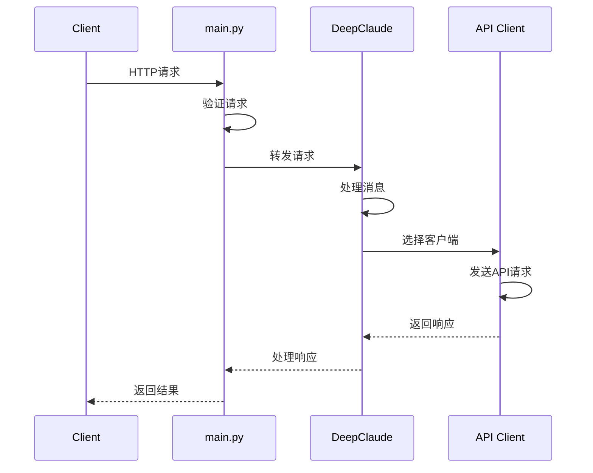
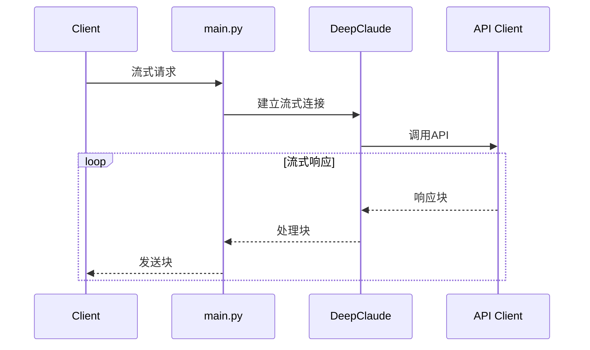
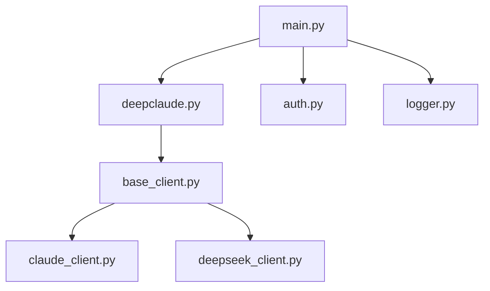

# DeepClaude 代码详细说明

## 1. 入口层

### 1.1 main.py

主要职责：系统入口和API路由管理

核心功能：
- 环境变量加载和配置管理
- FastAPI应用初始化和CORS配置
- API路由定义和请求处理
- 全局异常处理

关键代码实现：
```python
# 初始化 FastAPI 应用和 CORS 配置
app = FastAPI()
app.add_middleware(
    CORSMiddleware,
    allow_origins=["*"],  # 允许所有来源
    allow_methods=["*"],  # 允许所有方法
    allow_headers=["*"]   # 允许所有头部
)

# 环境变量配置
CLAUDE_API_KEY = os.getenv("CLAUDE_API_KEY")  # Claude API密钥
CLAUDE_MODEL = os.getenv("CLAUDE_MODEL")      # Claude模型名称
CLAUDE_PROVIDER = os.getenv("CLAUDE_PROVIDER", "anthropic")  # API提供商

# API路由 - 处理聊天请求
@app.post("/v1/chat/completions")
async def chat_completions(request: Request):
    # 解析请求体
    body = await request.json()
    messages = body.get("messages")  # 获取消息列表
    stream = body.get("stream", False)  # 是否使用流式响应
    
    # 初始化 DeepClaude 实例
    deep_claude = DeepClaude(
        deepseek_api_key=DEEPSEEK_API_KEY,
        claude_api_key=CLAUDE_API_KEY
    )
    
    # 根据stream参数选择处理方式
    if stream:
        return StreamingResponse(
            deep_claude.chat_completions_with_stream(messages),
            media_type="text/event-stream"
        )
    else:
        return await deep_claude.chat_completions_without_stream(messages)
```

## 2. 核心业务层

### 2.1 deepclaude/deepclaude.py

主要职责：核心业务逻辑实现

功能模块：
1. 消息处理
   - 请求格式转换
   - 响应数据处理
   - 流式响应管理

2. 错误处理
   - 重试机制
   - 异常处理
   - 错误恢复

3. API调用管理
   - 客户端选择
   - 请求分发
   - 响应聚合

关键代码实现：
```python
class DeepClaude:
    def __init__(self, deepseek_api_key: str, claude_api_key: str):
        # 初始化API客户端
        self.deepseek_client = DeepSeekClient(deepseek_api_key)
        self.claude_client = ClaudeClient(claude_api_key)

    async def chat_completions_with_stream(
        self,
        messages: list,
        model_arg: tuple[float, float, float, float],
    ) -> AsyncGenerator[bytes, None]:
        # 生成会话ID和时间戳
        chat_id = f"chatcmpl-{hex(int(time.time() * 1000))[2:]}"
        created_time = int(time.time())
        
        # 创建队列用于数据传输
        output_queue = asyncio.Queue()
        claude_queue = asyncio.Queue()
        reasoning_content = []

        async def process_deepseek():
            # 处理DeepSeek推理流程
            try:
                async for content_type, content in self.deepseek_client.stream_chat(messages):
                    if content_type == "reasoning":
                        # 收集推理内容
                        reasoning_content.append(content)
                        # 构造推理响应
                        response = {
                            "id": chat_id,
                            "choices": [{
                                "delta": {
                                    "reasoning_content": content
                                }
                            }]
                        }
                        await output_queue.put(f"data: {json.dumps(response)}\n\n".encode('utf-8'))
            except Exception as e:
                logger.error(f"DeepSeek处理错误: {e}")

        async def process_claude():
            # 处理Claude响应流程
            try:
                reasoning = await claude_queue.get()
                # 构造Claude输入消息
                claude_messages = messages.copy()
                combined_content = f"推理过程:\n{reasoning}\n\n基于此提供回答:"
                
                async for content in self.claude_client.stream_chat(claude_messages):
                    response = {
                        "id": chat_id,
                        "choices": [{
                            "delta": {"content": content}
                        }]
                    }
                    await output_queue.put(f"data: {json.dumps(response)}\n\n".encode('utf-8'))
            except Exception as e:
                logger.error(f"Claude处理错误: {e}")
```

## 3. 客户端层

### 3.1 clients/base_client.py

主要职责：定义基础客户端接口

核心功能：
- 基础HTTP请求封装
- 通用错误处理
- 重试逻辑

关键代码实现：
```python
class BaseClient:
    def __init__(self, api_key: str, base_url: str):
        self.api_key = api_key
        self.base_url = base_url
        self.session = aiohttp.ClientSession()

    async def _make_request(self, method: str, endpoint: str, **kwargs) -> Any:
        # 基础请求方法
        url = f"{self.base_url}{endpoint}"
        max_retries = 3
        retry_count = 0

        while retry_count < max_retries:
            try:
                async with self.session.request(method, url, **kwargs) as response:
                    if response.status == 200:
                        return await response.json()
                    elif response.status == 429:  # 速率限制
                        retry_after = int(response.headers.get('Retry-After', 5))
                        await asyncio.sleep(retry_after)
                    else:
                        response.raise_for_status()
            except Exception as e:
                retry_count += 1
                if retry_count == max_retries:
                    raise e
                await asyncio.sleep(2 ** retry_count)  # 指数退避
```

### 3.2 clients/claude_client.py

主要职责：Claude API客户端实现

核心功能：
- Claude API请求封装
- 响应格式转换
- 流式响应处理

关键代码实现：
```python
class ClaudeClient(BaseClient):
    async def stream_chat(self, messages: list, model: str = "claude-3") -> AsyncGenerator[str, None]:
        # 构造请求体
        data = {
            "model": model,
            "messages": messages,
            "stream": True
        }
        
        # 发送流式请求
        async with self.session.post(
            f"{self.base_url}/chat/completions",
            json=data,
            headers=self._get_headers(),
            timeout=60
        ) as response:
            async for line in response.content:
                if line.startswith(b'data: '):
                    try:
                        chunk = json.loads(line[6:])  # 解析数据块
                        if chunk.get('choices'):
                            content = chunk['choices'][0].get('delta', {}).get('content', '')
                            if content:
                                yield content
                    except json.JSONDecodeError:
                        continue
```

### 3.3 clients/deepseek_client.py

主要职责：DeepSeek API客户端实现

核心功能：
- DeepSeek API请求封装
- think标签处理
- 响应格式转换

关键代码实现：
```python
class DeepSeekClient(BaseClient):
    def _process_think_tag_content(self, content: str) -> tuple[bool, str]:
        # 处理think标签，提取推理内容
        has_start = "<think>" in content
        has_end = "</think>" in content
        if has_start and has_end:
            # 提取标签之间的内容
            start_idx = content.find("<think>") + 7
            end_idx = content.find("</think>")
            return True, content[start_idx:end_idx].strip()
        return False, content

    async def stream_chat(self, messages: list, model: str = "deepseek-chat") -> AsyncGenerator[tuple[str, str], None]:
        data = {
            "model": model,
            "messages": messages,
            "stream": True
        }
        
        async with self.session.post(
            f"{self.base_url}/chat/completions",
            json=data,
            headers=self._get_headers()
        ) as response:
            current_content = ""
            async for line in response.content:
                if line.startswith(b'data: '):
                    try:
                        chunk = json.loads(line[6:])
                        if chunk.get('choices'):
                            content = chunk['choices'][0].get('delta', {}).get('content', '')
                            current_content += content
                            # 检查是否包含think标签
                            has_think, think_content = self._process_think_tag_content(current_content)
                            if has_think:
                                yield "reasoning", think_content
                            else:
                                yield "content", content
                    except json.JSONDecodeError:
                        continue
```

## 4. 工具类

### 4.1 utils/auth.py

主要职责：认证和授权

核心功能：
- API密钥验证
- 请求认证

### 4.2 utils/logger.py

主要职责：日志管理

核心功能：
- 日志配置
- 日志记录

## 5. 调用链分析

### 5.1 标准请求流程



### 5.2 流式响应流程



## 6. 代码组织

### 6.1 目录结构说明

```
app/
├── clients/           # API客户端实现
│   ├── base_client.py    # 基础客户端类
│   ├── claude_client.py  # Claude客户端
│   └── deepseek_client.py# DeepSeek客户端
├── deepclaude/        # 核心业务逻辑
│   └── deepclaude.py     # 主要实现
├── utils/            # 工具类
│   ├── auth.py          # 认证工具
│   └── logger.py        # 日志工具
└── main.py          # 应用入口
```

### 6.2 代码依赖关系



## 7. 关键实现细节

### 7.1 消息处理

- 请求格式转换：根据不同API要求转换请求格式
- 响应处理：统一处理不同API的响应格式
- 流式处理：支持流式响应的处理和转发

### 7.2 错误处理

- 异常捕获：统一的异常处理机制
- 重试策略：针对不同错误类型的重试策略
- 错误恢复：系统错误状态的恢复机制

### 7.3 扩展设计

- 客户端扩展：支持添加新的API客户端
- 配置管理：灵活的配置项支持
- 中间件扩展：支持添加新的中间件