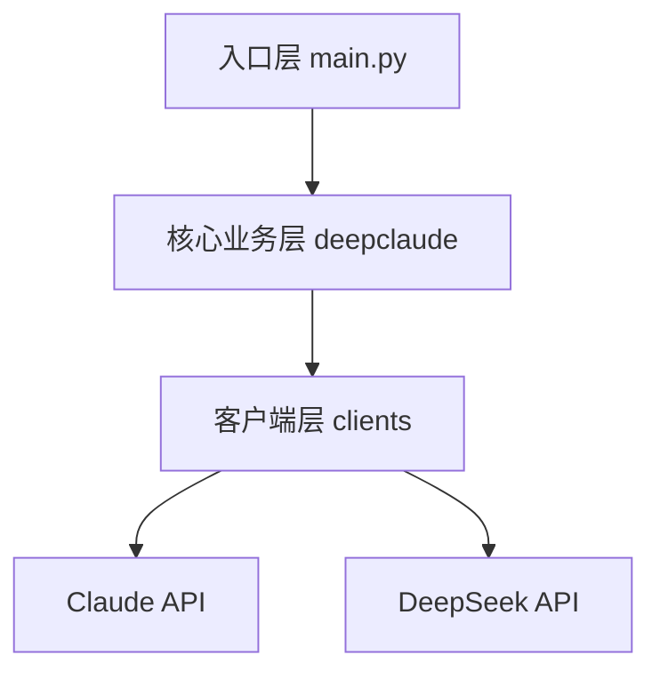
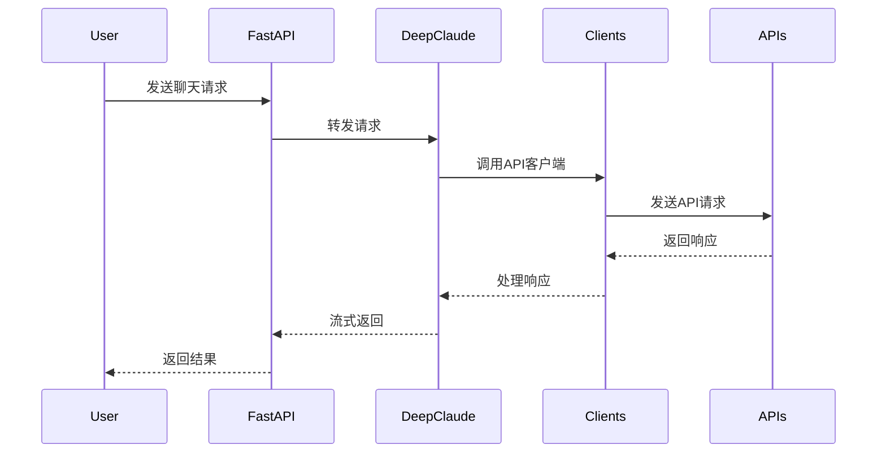
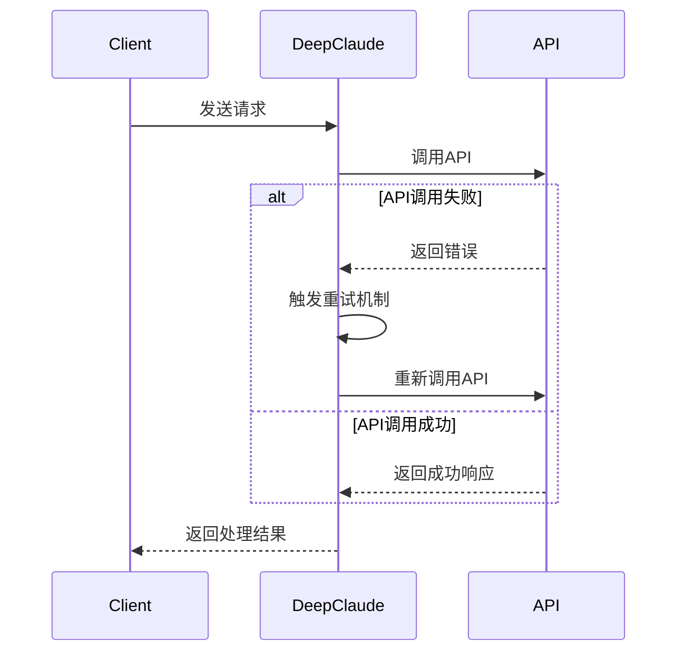
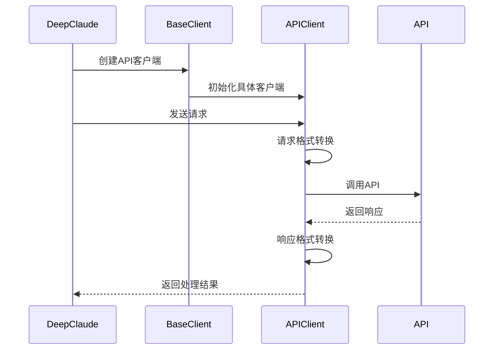
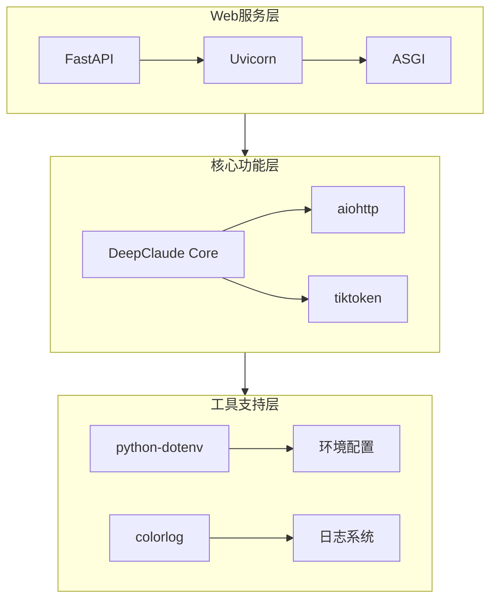
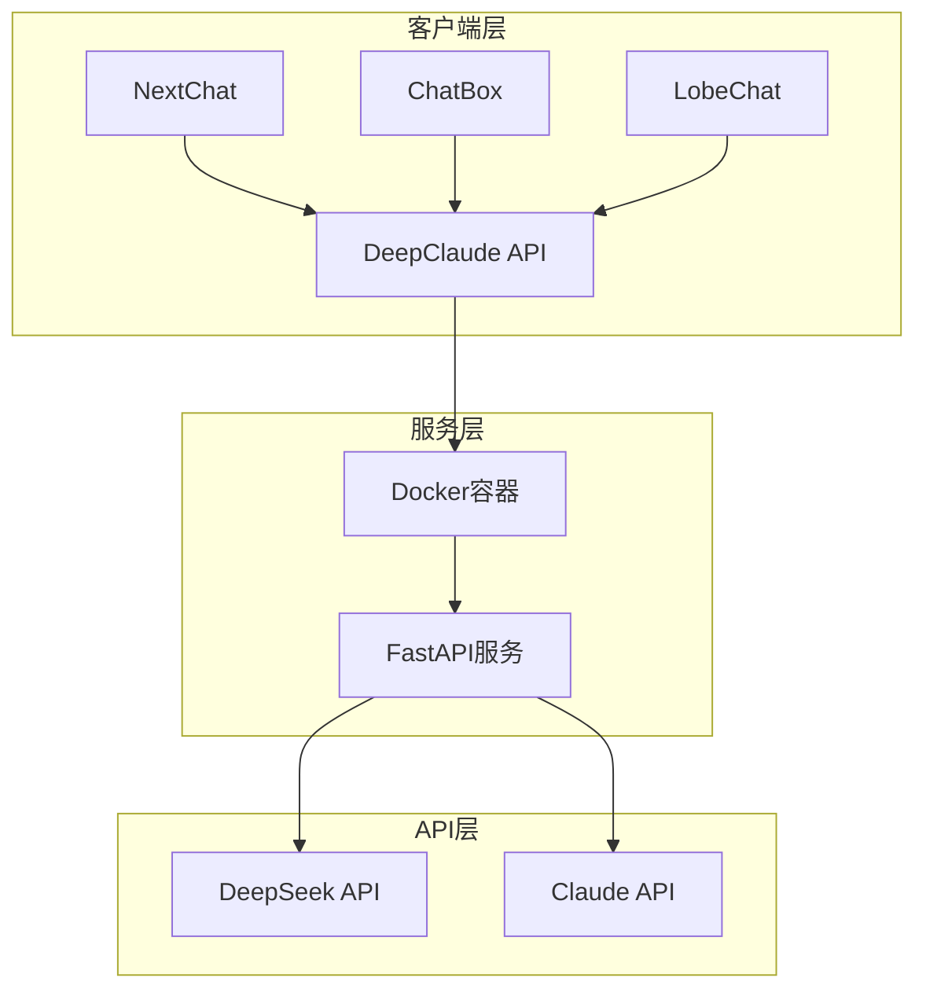
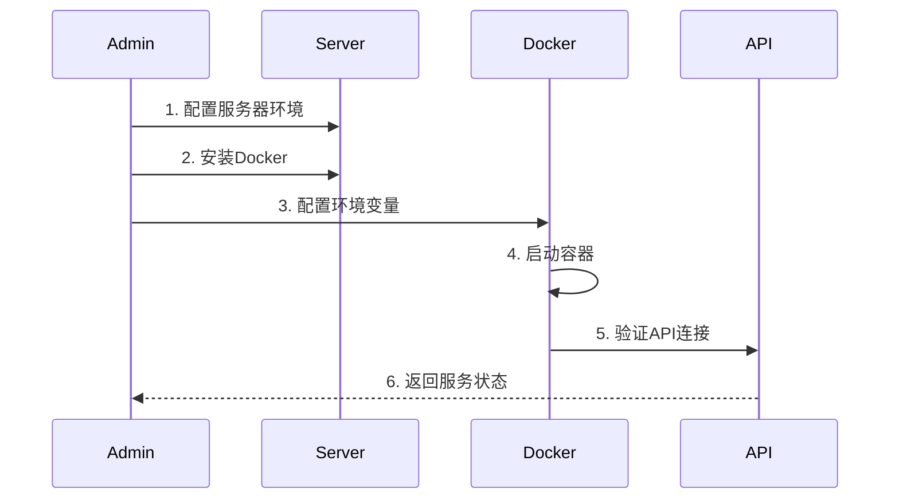

# DeepClaude 系统架构文档

## 1. 系统目录结构

```
.
├── app/                    # 主应用目录
│   ├── clients/           # 客户端实现层
│   ├── deepclaude/        # 核心业务层
│   ├── utils/             # 工具类
│   └── main.py            # 应用入口
├── doc/                   # 文档目录
└── docker/                # Docker相关配置
```

## 2. 系统架构设计

### 2.1 三层架构



1. **入口层 (app/main.py)**
   - 系统入口和API路由
   - 环境配置加载
   - 中间件处理
   - 跨域配置

2. **核心业务层 (app/deepclaude/)**
   - 实现核心业务逻辑
   - 消息处理和转发
   - 流式响应处理
   - 错误处理和重试机制

3. **客户端层 (app/clients/)**
   - API客户端封装
   - 请求格式转换
   - 响应处理
   - 异常处理

### 2.2 工作流程



## 3. 核心模块说明

### 3.1 FastAPI应用入口 (app/main.py)

**技术栈：**
- FastAPI: Web框架，提供高性能的API开发支持
- Uvicorn: ASGI服务器，用于运行FastAPI应用
- python-dotenv: 环境变量配置管理
- Starlette: 提供CORS、中间件等Web功能支持

**功能模块：**
- 配置加载和初始化
- API路由定义
- 请求验证和处理
- 错误处理中间件

### 3.2 DeepClaude核心 (app/deepclaude/deepclaude.py)

**技术栈：**
- Python异步编程: 使用async/await处理并发请求
- SSE (Server-Sent Events): 实现流式响应
- tiktoken: OpenAI的分词器，用于token计算
- JSON Schema: 请求和响应的数据验证

**功能模块：**
- 消息处理和转换
- 流式响应管理
- 错误重试策略
- 响应格式化

### 3.3 API客户端 (app/clients/)

**技术栈：**
- aiohttp: 异步HTTP客户端库
- colorlog: 彩色日志输出
- backoff: 实现指数退避重试机制
- pydantic: 数据模型验证

**功能模块：**
- base_client.py: 基础客户端类
- claude_client.py: Claude API客户端
- deepseek_client.py: DeepSeek API客户端

## 4. 关键流程

### 4.1 请求处理流程

1. 接收用户请求
2. 验证API密钥
3. 转换请求格式
4. 调用API服务
5. 处理响应数据
6. 返回结果

### 4.2 流式响应处理

1. 建立流式连接
2. 接收API响应
3. 处理响应块
4. 转换响应格式
5. 流式返回

## 5. 错误处理

- API调用异常处理
- 重试机制
- 超时处理
- 格式验证

## 6. 部署说明

### 6.1 环境要求

- Python 3.7+
- FastAPI
- Docker (可选)

### 6.2 配置项

- API密钥配置
- 服务地址配置
- CORS配置
- 日志级别设置

## 7. 扩展性设计

- 模块化的客户端设计
- 可插拔的API服务
- 统一的接口规范
- 可配置的处理流程

### 4.3 错误重试流程



### 4.4 API客户端调用流程



### 2.2 技术栈架构



### 2.3 部署架构



### 2.4 部署流程



## 8. 部署配置

### 8.1 环境变量配置

必要的环境变量配置：

```bash
# API访问控制
ALLOW_API_KEY=your_api_key
ALLOW_ORIGINS="*"

# DeepSeek配置
DEEPSEEK_API_KEY=your_deepseek_key
DEEPSEEK_API_URL=https://api.deepseek.com/v1/chat/completions
DEEPSEEK_MODEL=deepseek-reasoner
IS_ORIGIN_REASONING=true

# Claude配置
CLAUDE_API_KEY=your_claude_key
CLAUDE_MODEL=claude-3-5-sonnet-20241022
CLAUDE_PROVIDER=anthropic
CLAUDE_API_URL=https://api.anthropic.com/v1/messages

# 日志配置
LOG_LEVEL=INFO
```

### 8.2 Docker部署配置

1. **Docker Compose配置**

```yaml
version: '3'
services:
  deepclaude:
    image: erlichliu/deepclaude:latest
    container_name: deepclaude
    ports:
      - "8000:8000"
    environment:
      - ALLOW_API_KEY=${ALLOW_API_KEY}
      - ALLOW_ORIGINS=${ALLOW_ORIGINS}
      - DEEPSEEK_API_KEY=${DEEPSEEK_API_KEY}
      - DEEPSEEK_API_URL=${DEEPSEEK_API_URL}
      - DEEPSEEK_MODEL=${DEEPSEEK_MODEL}
      - IS_ORIGIN_REASONING=${IS_ORIGIN_REASONING}
      - CLAUDE_API_KEY=${CLAUDE_API_KEY}
      - CLAUDE_MODEL=${CLAUDE_MODEL}
      - CLAUDE_PROVIDER=${CLAUDE_PROVIDER}
      - CLAUDE_API_URL=${CLAUDE_API_URL}
      - LOG_LEVEL=${LOG_LEVEL}
    restart: always
```

2. **Nginx配置示例**

```nginx
server {
    listen 80;
    server_name your_domain.com;

    location / {
        proxy_pass http://localhost:8000;
        proxy_set_header Host $host;
        proxy_set_header X-Real-IP $remote_addr;
        proxy_set_header X-Forwarded-For $proxy_add_x_forwarded_for;
        proxy_set_header X-Forwarded-Proto $scheme;
    }
}
```

### 8.3 安全配置

1. **API访问控制**
- 设置ALLOW_API_KEY进行认证
- 配置ALLOW_ORIGINS限制跨域访问

2. **SSL/TLS配置**
- 使用Let's Encrypt配置HTTPS
- 启用SSL证书自动更新

3. **Docker安全配置**
- 限制容器资源使用
- 配置容器网络隔离
- 定期更新镜像

### 8.4 监控和日志

1. **日志配置**
- 设置LOG_LEVEL控制日志级别
- 配置日志轮转策略

2. **监控指标**
- API请求量监控
- 响应时间监控
- 错误率监控
- 资源使用监控