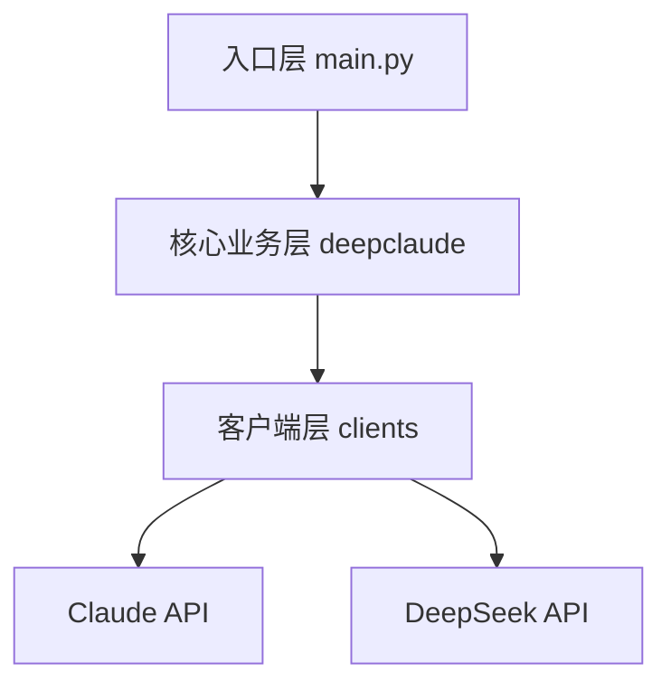
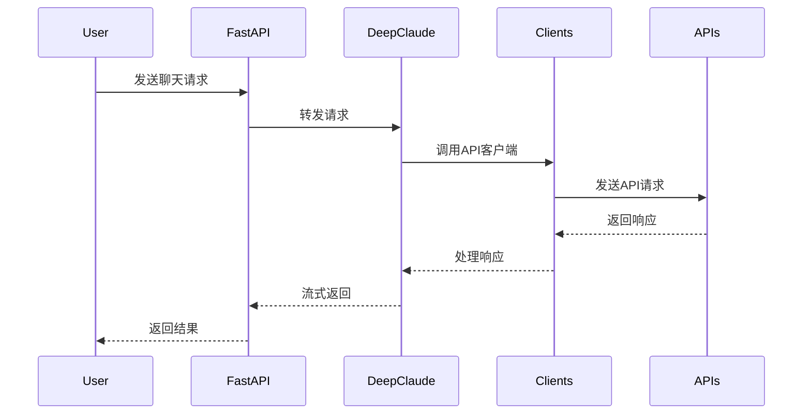
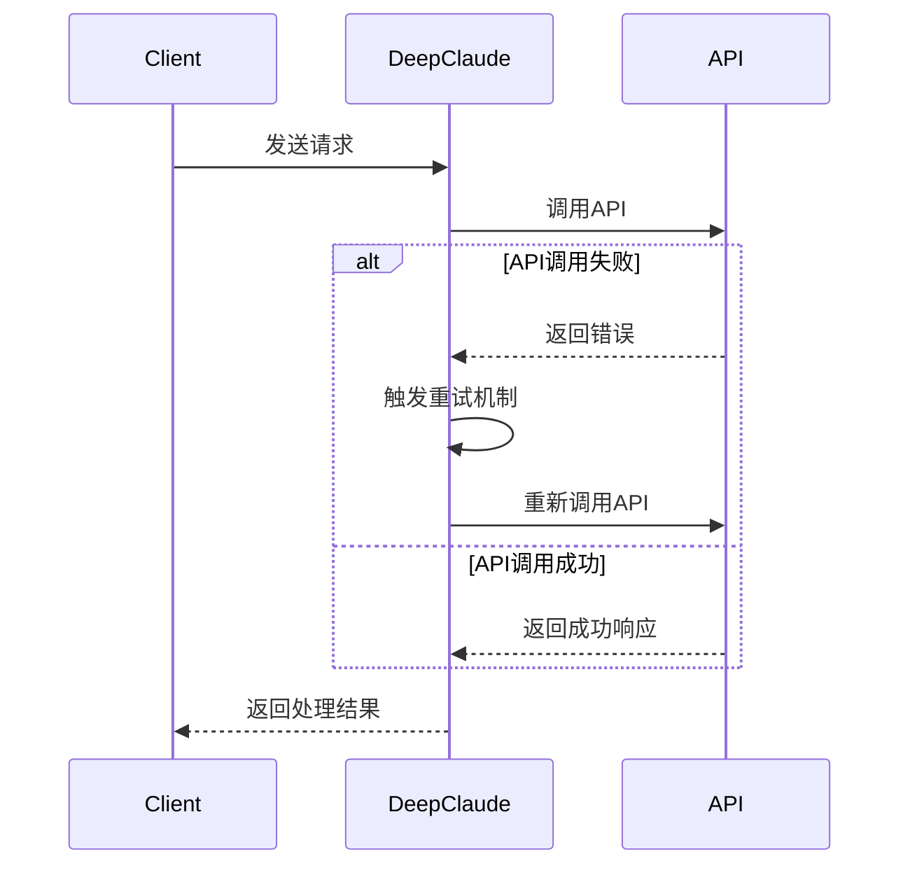

# DeepClaude 系统架构文档

## 1. 系统目录结构

```
.
├── app/                    # 主应用目录
│   ├── clients/           # 客户端实现层
│   ├── deepclaude/        # 核心业务层
│   ├── utils/             # 工具类
│   └── main.py            # 应用入口
├── doc/                   # 文档目录
└── docker/                # Docker相关配置
```

## 2. 系统架构设计

### 2.1 三层架构



1. **入口层 (app/main.py)**
   - 系统入口和API路由
   - 环境配置加载
   - 中间件处理
   - 跨域配置

2. **核心业务层 (app/deepclaude/)**
   - 实现核心业务逻辑
   - 消息处理和转发
   - 流式响应处理
   - 错误处理和重试机制

3. **客户端层 (app/clients/)**
   - API客户端封装
   - 请求格式转换
   - 响应处理
   - 异常处理

### 2.2 工作流程



## 3. 核心模块说明

### 3.1 FastAPI应用入口 (app/main.py)

**技术栈：**
- FastAPI: Web框架，提供高性能的API开发支持
- Uvicorn: ASGI服务器，用于运行FastAPI应用
- python-dotenv: 环境变量配置管理
- Starlette: 提供CORS、中间件等Web功能支持

**功能模块：**
- 配置加载和初始化
- API路由定义
- 请求验证和处理
- 错误处理中间件

### 3.2 DeepClaude核心 (app/deepclaude/deepclaude.py)

**技术栈：**
- Python异步编程: 使用async/await处理并发请求
- SSE (Server-Sent Events): 实现流式响应
- tiktoken: OpenAI的分词器，用于token计算
- JSON Schema: 请求和响应的数据验证

**功能模块：**
- 消息处理和转换
- 流式响应管理
- 错误重试策略
- 响应格式化

### 3.3 API客户端 (app/clients/)

**技术栈：**
- aiohttp: 异步HTTP客户端库
- colorlog: 彩色日志输出
- backoff: 实现指数退避重试机制
- pydantic: 数据模型验证

**功能模块：**
- base_client.py: 基础客户端类
- claude_client.py: Claude API客户端
- deepseek_client.py: DeepSeek API客户端

## 4. 关键流程

### 4.1 请求处理流程

1. 接收用户请求
2. 验证API密钥
3. 转换请求格式
4. 调用API服务
5. 处理响应数据
6. 返回结果

### 4.2 流式响应处理

1. 建立流式连接
2. 接收API响应
3. 处理响应块
4. 转换响应格式
5. 流式返回

## 5. 错误处理

- API调用异常处理
- 重试机制
- 超时处理
- 格式验证

## 6. 部署说明

### 6.1 环境要求

- Python 3.7+
- FastAPI
- Docker (可选)

### 6.2 配置项

- API密钥配置
- 服务地址配置
- CORS配置
- 日志级别设置

## 7. 扩展性设计

- 模块化的客户端设计
- 可插拔的API服务
- 统一的接口规范
- 可配置的处理流程

### 4.3 错误重试流程



### 4.4 API客户端调用流程

```mermaid
sequenceDiagram
    participant DeepClaude
    participant BaseClient
    participant APIClient
    participant API

    DeepClaude->>BaseClient: 创建API客户端
    BaseClient->>APIClient: 初始化具体客户端
    DeepClaude->>APIClient: 发送请求
    APIClient->>APIClient: 请求格式转换
    APIClient->>API: 调用API
    API-->>APIClient: 返回响应
    APIClient->>APIClient: 响应格式转换
    APIClient-->>DeepClaude: 返回处理结果